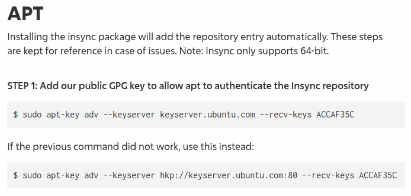
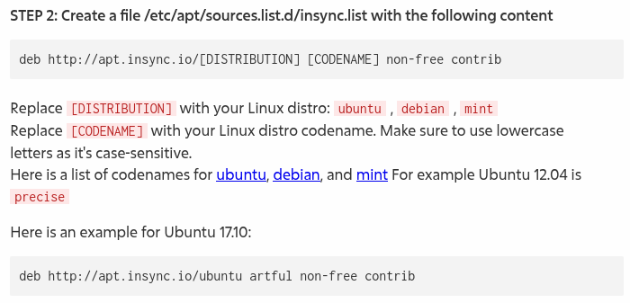

# README for 3rd party repository / PPA packages

I prefer linux nowadays compared to windows, but I still have some issues such as:

- Outdated software package (default repository tend to have outdated version)
- Your favourite software wasn't provided by default repository
- You want to use proprietary software which isn't open source

Above problems can be solved by adding 3rd party repository or PPA,
this guide will tell you some **DO** and **DON'T**

# Adding 3rd party repository in the correct way

Nowadays most of 3rd party repository guide will use `add-apt-repository` cli,
this approach is safer since it will enforce 3rd party key only for said repository.
If your repository guide was using it therefore just follow thier, this guide for older guide which using `apt-key` instead.
I will take [Insync](https://www.insynchq.com/downloads/linux#apt) as example, their guide still use `apt-key` cli.

## Migrate from `apt-key` to safer approach manually



First we need to extract Insync gpg key, based on their guide:

`sudo apt-key adv --keyserver keyserver.ubuntu.com --recv-keys ACCAF35C`

Above command will make Insync key trusted for every repositories, it was a bad practice. Let fix it:

- To obtain the key we will use `keyserver.ubuntu.com` server, open it and search for `0xACCAF35C` (it come from `--recv-keys ACCAF35C` part prefixed with `0x`).
- Once the key was found you will be redirected to `https://keyserver.ubuntu.com/pks/lookup?search=0xACCAF35C&fingerprint=on&op=index`
- We need to download the key, please take a look at `&op=index` part which will show you the key details, just change it into `&op=get` and you will download its key.
  - command: `curl -o insync.asc "https://keyserver.ubuntu.com/pks/lookup?search=0xACCAF35C&fingerprint=on&op=get"`
- Given key was in armored format, refer to `-----BEGIN PGP PUBLIC KEY BLOCK-----` in the beginning, we have to dearmor it first.
- Dearmor by `gpg` CLI
  - command: `sudo gpg --dearmor --output /etc/apt/keyrings/insync.gpg insync.asc`
- Do in one line: `curl -fsSL "https://keyserver.ubuntu.com/pks/lookup?search=0xACCAF35C&fingerprint=on&op=get" | sudo gpg --dearmor --output /etc/apt/keyrings/insync.gpg`

Technically speaking you can put the dearmored gpg key anywhere in your system directory, but it's recommended to put those keys inside same folder.
`apt-add-reposiory` will store gpg key under `/etc/apt/keyrings/` folder, we should follow the lead.

## Write correct apt `source.list` with proper key



Once gpg key successfully extracted we have to add the repository to `apt.source.d`. For the content should follow Insync guide with additional configuration. (TL;DR we need to add `signed-by=...` attribute)

```sh
echo "deb [arch=amd64 signed-by=/etc/apt/keyrings/insync.gpg] http://apt.insync.io/mint virginia non-free contrib" | sudo tee /etc/apt/sources.list.d/insync.list
```

Additionally we can add `arch=amd64` before `signed-by=...` attribute.

## Migrate from `/etc/apt/trusted.gpg.d` global `gpg` key trust folder.

Storing `gpg` key under `/etc/apt/trusted.gpg.d` have similar effect with `apt-key` command which store in `trusted.gpg` file.

Based on [official guide](https://software.opensuse.org/download.html?project=home%3AAlexx2000&package=doublecmd-gtk) installing double commander

```sh
echo 'deb http://download.opensuse.org/repositories/home:/Alexx2000/xUbuntu_22.04/ /' | sudo tee /etc/apt/sources.list.d/home:Alexx2000.list
curl -fsSL https://download.opensuse.org/repositories/home:Alexx2000/xUbuntu_22.04/Release.key | gpg --dearmor | sudo tee /etc/apt/trusted.gpg.d/home_Alexx2000.gpg > /dev/null
sudo apt update
sudo apt install doublecmd-gtk
```

- There is no issue with first command, it will store software source in a dedicated file, but it missing `signed-by=...` attribute
- On line #2 it will store `gpg` key inside `/etc/apt/trusted.gpg.d` which will be accepted for every repositories.
- No issues with line #3 and #4

Fixing will be easy, we just need to change `gpg` output and add `signed-by=...` attribute as follow:

```sh
curl -fsSL https://download.opensuse.org/repositories/home:Alexx2000/xUbuntu_22.04/Release.key | sudo gpg --dearmor --output /etc/apt/keyrings/double-commander.gpg
echo 'deb [arch=amd64 signed-by=/etc/apt/keyrings/double-commander.gpg] http://download.opensuse.org/repositories/home:/Alexx2000/xUbuntu_22.04/ /' | sudo tee /etc/apt/sources.list.d/double-commander.list
sudo apt-get update
sudo apt-get install doublecmd-gtk
```

# Ready to use software (already built by provider)

In case your software already build by the provider, and they didn't provide any repository, then just download it.
The only rule applied to this scenario is: **Install in non system partition (mandatory), then create menu link (optional)**

## Software binary already built

This a pure bliss, the software is "portable" and can be run directly.

> Pro Tips: utilize `ln` to allow seamless application rollback

## `.deb` installation provided

This a pure bliss, just double click, it's similar with `.exe` / `.msi` installer from Windows.
